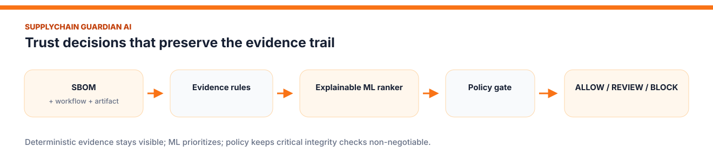
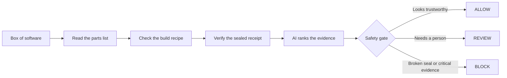
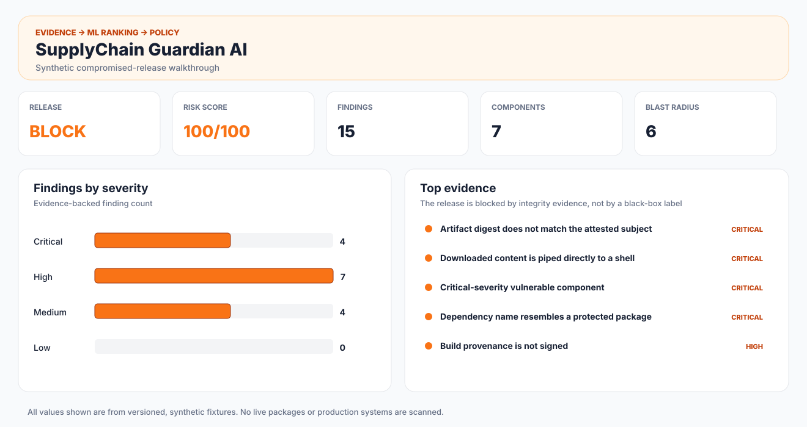
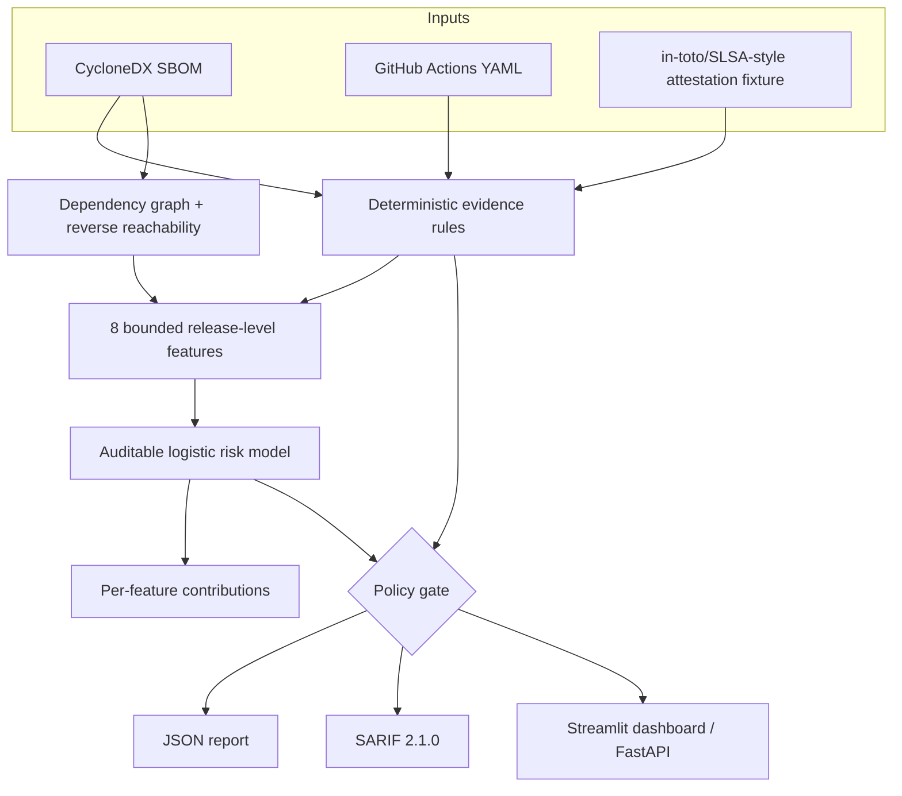

<div align="center">

# SupplyChain Guardian AI

### Explainable software supply-chain, CI/CD, SBOM, and build-provenance risk analysis

[](https://www.python.org/)
[](https://github.com/VinayK88/supplychain-guardian-ai/actions/workflows/ci.yml)
[](https://cyclonedx.org/specification/overview/)
[](https://docs.oasis-open.org/sarif/sarif/v2.1.0/)
[](#safety-boundary)
[](LICENSE)

**Inspect · verify · rank · explain · gate · reproduce**

</div>

---



SupplyChain Guardian AI answers one practical question:

> **Can we trust this dependency, CI workflow, and build artifact enough to release it?**

It combines deterministic security evidence, dependency-graph reachability, a small auditable ML risk model, and a policy gate. The checked-in demo is safe and fully synthetic: it does not download packages, execute untrusted code, access registries, or modify a real release.

## ELI5: explain it like I am five

Imagine a toy factory receives a box of parts:

1. **The SBOM is the parts list.** It says which wheels, screws, and batteries are inside.
2. **The workflow is the assembly recipe.** It explains who builds the toy and which tools they use.
3. **The attestation is the sealed receipt.** It says where the finished toy came from and includes its fingerprint.
4. **Guardian is the careful inspector.** It notices a misspelled part, an unsafe recipe, or a receipt whose fingerprint does not match.
5. **The model sorts the warning pile.** It estimates which combination of warnings deserves attention first.
6. **The policy makes the decision.** A broken seal always blocks the toy—even if the model is unsure.



## What the demo catches

| Layer | Evidence collected | Example response |
| --- | --- | --- |
| SBOM | Typosquatting, unpinned versions, synthetic critical advisories, weak component identity | Quarantine or replace the dependency |
| Package behavior | New publisher plus abnormal synthetic download ratio | Require maintainer and provenance verification |
| GitHub Actions | `write-all`, `pull_request_target`, self-hosted runner exposure, mutable action refs, secret interpolation, download-to-shell | Reduce permissions and isolate the build |
| Provenance | Digest mismatch, missing signature, missing transparency inclusion, unexpected builder | Block promotion and rebuild from trusted source |
| Dependency graph | Reverse reachability from a suspect component | Prioritize affected services |
| ML | Combined evidence pattern and feature contribution | Rank the release and explain the score |
| Policy | Critical overrides and score thresholds | Emit `ALLOW`, `REVIEW`, or `BLOCK` |

## Checked-in baseline



| Synthetic scenario | Score | Decision | Findings | What drives it |
| --- | ---: | --- | ---: | --- |
| Trusted release | 4/100 | **ALLOW** | 0 | Pinned workflow actions and matching signed provenance fields |
| Compromised release | 100/100 | **BLOCK** | 15 | Typosquat, unsafe CI execution, and artifact digest mismatch |

The lightweight logistic ranker reaches **86.1% F1**, **88.1% precision**, and **84.3% recall** on a fixed set of 120 held-out synthetic scans. These values validate the code and evaluation path; they are **not evidence of production generalization**. See [`reports/model-evaluation.json`](reports/model-evaluation.json) for the complete checked-in result.

## Architecture



The separation is intentional:

- **Rules establish evidence.** Every finding contains a subject, observation, severity, confidence, blast radius, and remediation.
- **ML prioritizes combinations.** The runtime ranker is a standard-library logistic model with versioned weights, means, and scales.
- **Policy remains authoritative.** Digest mismatch and other critical findings cannot be averaged away by a low probability.

## Quick start

```bash
git clone https://github.com/VinayK88/supplychain-guardian-ai.git
cd supplychain-guardian-ai

python -m venv .venv
source .venv/bin/activate
python -m pip install -e .

supplychain-guardian scan --scenario secure
supplychain-guardian scan --scenario compromised --sarif reports/local-scan.sarif
python -m unittest discover -s tests -v
```

To turn the scanner into a CI gate, add `--fail-on-block`. A blocked release returns exit code `2`.

```bash
supplychain-guardian scan \
  --sbom build/bom.cdx.json \
  --workflow .github/workflows/release.yml \
  --attestation build/attestation.json \
  --output build/guardian-report.json \
  --sarif build/guardian-report.sarif \
  --fail-on-block
```

## Interactive dashboard

```bash
python -m pip install -e ".[app]"
streamlit run dashboard/app.py
```

The first screen is useful before any click: it opens the compromised synthetic scenario and shows the decision, risk score, severity distribution, blast radius, model contributions, evidence table, and JSON/SARIF downloads. Switch to the trusted fixture or upload your own three documents from the sidebar.

## FastAPI

```bash
uvicorn supplychain_guardian.api:app --reload
```

```bash
curl http://127.0.0.1:8000/health
curl http://127.0.0.1:8000/samples/compromised
```

`POST /scan` accepts `sbom`, `workflow`, `workflow_raw`, `attestation`, and an optional `scenario` label. Interactive OpenAPI documentation is available at `/docs`.

## Executed notebooks

| Notebook | Question | ML / visual evidence |
| --- | --- | --- |
| [`01_sbom_dependency_risk.ipynb`](notebooks/01_sbom_dependency_risk.ipynb) | Which dependency evidence creates the largest potential impact? | Severity bars, ranked blast radius, dependency graph |
| [`02_ci_cd_compromise_ml.ipynb`](notebooks/02_ci_cd_compromise_ml.ipynb) | Can evidence features distinguish synthetic compromised releases? | Random Forest vs Isolation Forest, confusion matrices, PR curve, feature importance |
| [`03_release_policy_simulation.ipynb`](notebooks/03_release_policy_simulation.ipynb) | Where should allow/review/block thresholds sit under explicit costs? | Threshold cost heatmap, policy volume, calibration plot |

All three notebooks are executed top-to-bottom with embedded outputs. Rebuild them with:

```bash
python -m pip install -e ".[notebooks]"
python scripts/rebuild_artifacts.py
python scripts/build_notebooks.py
python scripts/execute_notebooks.py
```

## Model card

| Item | Design |
| --- | --- |
| Intended use | Rank synthetic release scans for analyst review and demonstrate explainable ML integration |
| Unit of prediction | One bundle containing an SBOM, CI workflow, and attestation |
| Features | Severity counts, provenance failures, workflow exposures, vulnerable components, blast ratio |
| Runtime model | Logistic regression trained with deterministic gradient descent |
| Notebook comparators | Random Forest and benign-only Isolation Forest |
| Explanation | Signed standardized-feature contribution to the logistic model's log odds |
| Ground truth | Seeded synthetic labels across five scenario families |
| Human oversight | REVIEW band plus critical-evidence policy overrides |
| Not intended for | Autonomous blocking of production releases without real verifier integrations and validation |

## Repository map

```text
dashboard/app.py                  interactive reviewer dashboard
src/supplychain_guardian/
├── rules.py                     evidence checks
├── graph.py                     dependency blast radius
├── risk_model.py                transparent learned ranker
├── policy.py                    allow/review/block guardrails
├── scanner.py                   orchestration
├── sarif.py                     CI/code-scanning export
├── api.py                       FastAPI service
└── cli.py                       local and CI entrypoint
data/                            versioned SBOM, workflow, attestation, and ML fixtures
models/                          checked-in model artifact
notebooks/                       three executed investigations
reports/                         JSON, SARIF, and held-out evaluation evidence
assets/                          generated GitHub-ready visuals
tests/                           policy, graph, model, determinism, and export checks
scripts/                         reproducible artifact and notebook builders
```

## Why this matters now

- [GitHub artifact attestations](https://docs.github.com/en/actions/concepts/security/artifact-attestations) provide signed provenance and can include an SBOM, while verification and policy decide whether that evidence is trusted.
- [CISA's SBOM consumption guidance](https://www.cisa.gov/sites/default/files/2024-08/SECURING_THE_SOFTWARE_SUPPLY_CHAIN_RECOMMENDED_PRACTICES_FOR_SOFTWARE_BILL_OF_MATERIALS_CONSUMPTION-508.pdf) emphasizes component visibility, prioritization, and operational use—not merely generating a parts list.
- [OpenSSF Scorecard](https://scorecard.dev/) demonstrates the value of automated security-posture signals for open-source dependencies.
- [Sigstore](https://docs.sigstore.dev/) provides an ecosystem for signing and verifying software artifacts and identities.

The repository includes a manual GitHub Actions workflow that builds the package and generates build provenance. The included scanner fixture is deliberately simpler than a real Sigstore or GitHub verification flow; production integration should invoke the platform verifier and pass the verified claims into policy.

## Safety boundary

```text
Package downloads       not implemented
Dependency execution    not implemented
Registry access         not implemented
Real credentials        not included or requested
Artifact publication    not performed
Release modification    not performed
Threat intelligence     synthetic fixture properties only
Attestation check       declared demo fields, not cryptographic verification
```

## Limitations and responsible next steps

1. Integrate `gh attestation verify` or Sigstore verification instead of trusting fixture signature fields.
2. Add real SPDX ingestion and package-ecosystem adapters behind bounded, authenticated interfaces.
3. Replace synthetic labels with reviewed historical incidents and time-based evaluation.
4. Measure alert-review time, false blocks, and package-ecosystem drift.
5. Run the policy in shadow mode before any production enforcement.
6. Emit provenance and SBOM attestations for Guardian's own release artifacts.

Licensed under the [MIT License](LICENSE).

